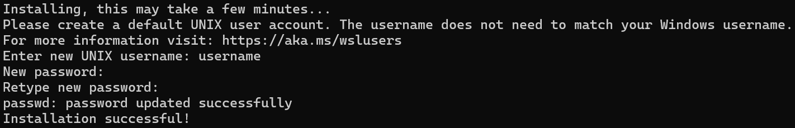
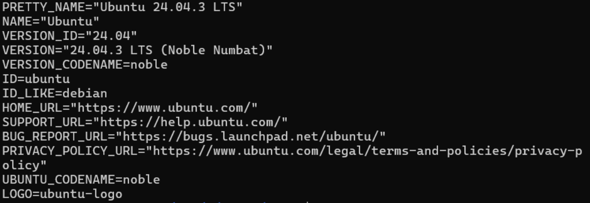
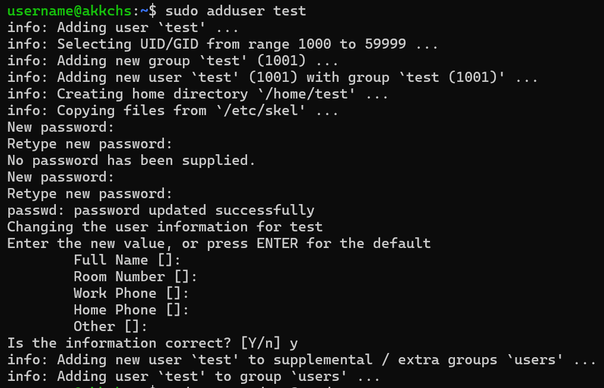
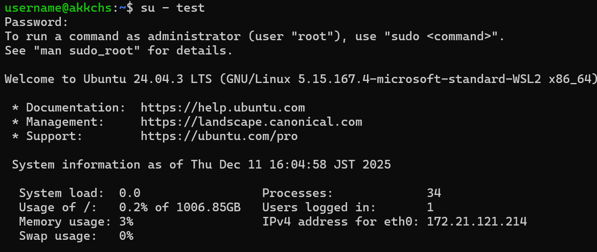
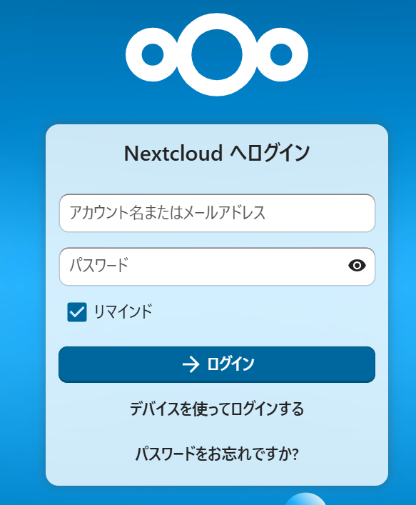
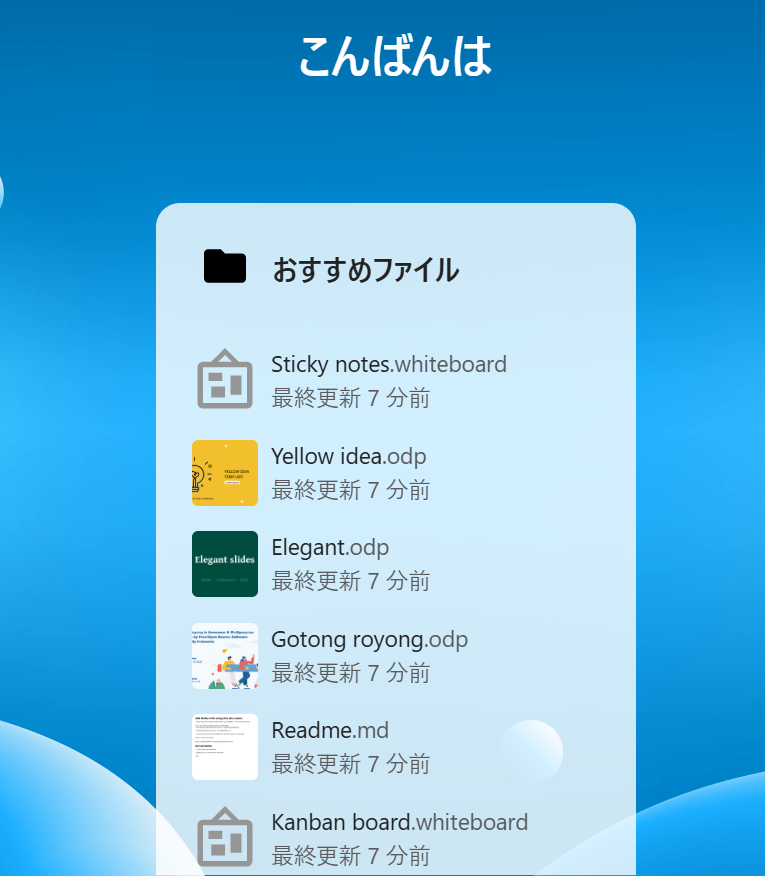
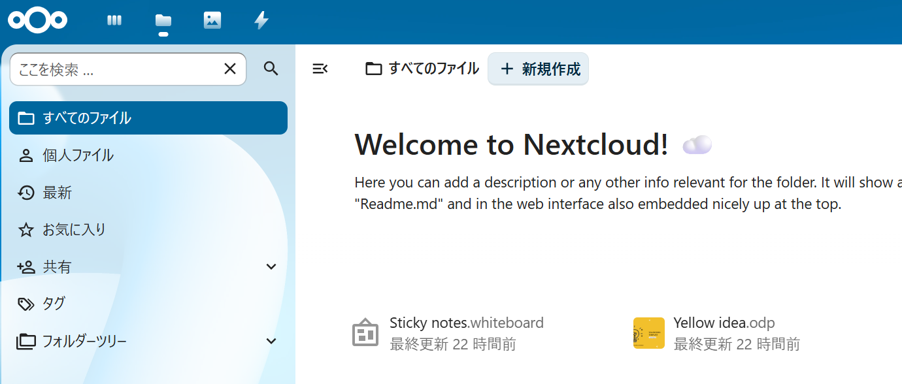

-----

# WSL2でNextcloud環境を構築する完全ガイド

## 目次

- [はじめに](#はじめに)
- [システム構成](#システム構成)
- [1. 事前準備：WSL2とUbuntuのインストール](#1-事前準備wsl2とubuntuのインストール)
  - [1-1. WSL2環境の初期セットアップ](#1-1-wsl2環境の初期セットアップ)
  - [1-2. WSL2のバージョン確認と設定](#1-2-wsl2のバージョン確認と設定)
  - [1-3. 作業用ユーザーの作成](#1-3-作業用ユーザーの作成)
  - [1-4. 新規ユーザーでログイン](#1-4-新規ユーザーでログイン)
- [2. Docker Engineのインストール](#2-docker-engineのインストール)
  - [2-1. 必要なパッケージのインストール](#2-1-必要なパッケージのインストール)
  - [2-2. Docker Composeの追加](#2-2-docker-composeの追加)
  - [2-3. 権限設定と動作確認](#2-3-権限設定と動作確認)
- [3. 設定ファイルの作成](#3-設定ファイルの作成)
  - [3-1. 環境変数ファイル (.env) の作成](#3-1-環境変数ファイル-envの作成)
  - [3-2. Docker Compose設定ファイル (docker-compose.yml) の作成](#3-2-docker-compose設定ファイル-docker-composeymlの作成)
  - [3-3. 最終的なディレクトリ構成の確認](#3-3-最終的なディレクトリ構成の確認)
- [4. サーバーの起動](#4-サーバーの起動)
  - [4-1. コンテナの起動](#4-1-コンテナの起動)
  - [4-2. 稼働状態の確認](#4-2-稼働状態の確認)
- [5. ブラウザでの動作確認](#5-ブラウザでの動作確認)
- [6. データの永続化テスト](#6-データの永続化テスト)
- [7. トラブルシューティング](#7-トラブルシューティング)
- [8. セキュリティ配慮](#8-セキュリティ配慮)
- [9. 参考資料](#9-参考資料)

-----

## はじめに

この記事では、Windows上のWSL2環境でDockerを使って、プライベートクラウド「Nextcloud」を構築する手順を解説します。

### この記事で作るもの

  * **Nextcloud**: 自分専用のオンラインストレージ（GoogleドライブやDropboxのようなもの）
  * **MariaDB**: データを保存するデータベース
  * **Redis**: 高速化のためのキャッシュサーバー

### 完成後にできること

  * ✅ ブラウザで `http://localhost:8080` にアクセスしてファイルをアップロード・管理できる
  * ✅ コンテナを削除してもデータが消えない（永続化）
  * ✅ セキュアな内部ネットワークで各サービスが連携

-----

## システム構成


### 各サービスの役割

| サービス | 役割 | ポート | 外部アクセス |
| :--- | :--- | :--- | :--- |
| **Nextcloud** | Webアプリケーション本体 | 8080 | ⭕ 可能 |
| **MariaDB** | ユーザー情報やファイル情報を管理 | 3306 | ❌ 不可（セキュリティ向上） |
| **Redis** | セッション情報を高速キャッシュ | 6379 | ❌ 不可（セキュリティ向上） |

-----

## 1\. 事前準備：WSL2とUbuntuのインストール

### 1-1. WSL2環境の初期セットアップ

まずはWSL2とUbuntuをインストールします。すでにインストール済みの場合は、**1-4**までスキップしてください。
Windows PowerShellを開き、以下のコマンドを実行します。

```powershell
wsl --install
```

> **ポイント**
> このコマンドを実行するだけで、WSL2とUbuntuが自動的にインストールされます。

### 1-2. WSL2のバージョン確認と設定

Ubuntuを起動します。初期起動時はユーザー名とパスワードの設定を求められるので入力してください。（このユーザーは後の工程で使用しませんが、管理用として設定が必要です。）



インストールが完了したら、次のコマンドでバージョンを確認してください。
`Ubuntu 24.04.3 LTS` と表示されれば、正しくインストールできています。

```bash
cat /etc/os-release
```



> **補足**
> 次回以降は、PowerShell等で以下のコマンドを実行すると起動できます。
>
> ```powershell
> wsl.exe -d Ubuntu-24.04
> ```

### 1-3. 作業用ユーザーの作成

インストール直後のデフォルトユーザーは、WindowsのCドライブ等がマウントされた状態で操作することになり、誤操作のリスクがあります。そのため、サーバー構築専用の新しいユーザーを作成して作業を行います。

ここではユーザー `test` を作成します。

1.  `sudo` コマンドを使用するため、先ほど設定したパスワードを入力します。
2.  その後、新規ユーザー `test` 用のパスワードを設定します。
3.  `Full Name` などの情報は、何も入力せずEnterキーを押して進めて構いません。

<!-- end list -->

```bash
# ユーザーを新規作成
sudo adduser test
```

**実行結果の例:**

```text
[sudo] password for kimura:  # 現在のユーザーのパスワードを入力
info: Adding user `test' ...
info: Selecting UID/GID from range 1000 to 59999 ...
info: Adding new group `test' (1001) ...
info: Adding new user `test' (1001) with group `test (1001)' ...
info: Creating home directory `/home/test' ...
info: Copying files from `/etc/skel' ...
New password:   # 新しく作成するユーザーのパスワードを設定
Retype new password:
passwd: password updated successfully
Changing the user information for test
Enter the new value, or press ENTER for the default
        Full Name []:   # 何もせずEnterでOK
        Room Number []:   # 同上
        Work Phone []:   # 同上
        Home Phone []:   # 同上
        Other []:   # 同上
Is the information correct? [Y/n]   # Y と入力してEnter
info: Adding new user `test' to supplemental / extra groups `users' ...
info: Adding user `test' to group `users' ...
```



### 1-4. 新規ユーザーでログイン

作成した `test` ユーザーにsudo権限（管理者権限）を付与し、ログインを切り替えます。

```bash
# testユーザーにsudo権限を付与
sudo usermod -aG sudo test

# testユーザーに切り替え（パスワードを求められたら入力）
su - test
```



-----

## 2\. Docker Engineのインストール

Nextcloud用のディレクトリを作成し、移動します。

```bash
# ディレクトリ作成
mkdir nextcloud

# ディレクトリへ移動
cd nextcloud
```

### 2-1. 必要なパッケージのインストール

パッケージリストを更新し、Docker本体をインストールします。

```bash
sudo apt update
sudo apt install -y docker.io
```

Dockerが正しくインストールされたか確認します。

```
docker --version
```

**成功時の表示例**:

> Docker version 28.2.2, build 28.2.2-0ubuntu1\~24.04.1

### 2-2. Docker Composeの追加

Docker Composeの最新バージョン（v2.40.3）をGitHubからダウンロードしてインストールします。

```bash
# ファイルのダウンロード
sudo curl -L "https://github.com/docker/compose/releases/download/v2.40.3/docker-compose-$(uname -s)-$(uname -m)" -o /usr/local/bin/docker-compose

# 実行権限を付与（重要）
sudo chmod +x /usr/local/bin/docker-compose
```

Docker Composeが正しくインストールされているか確認します。

```
docker-compose --version
```

**成功時の表示例**:

> Docker Compose version v2.40.3

### 2-3. 権限設定と動作確認

毎回 `sudo` を入力せずにDockerコマンドを実行できるように、現在のユーザーを `docker` グループに追加します。

```
# ユーザーをdockerグループに追加
sudo usermod -aG docker test

# 設定を反映させる
newgrp docker
```

最後に、sudoなしでDockerが動くかテストします。

```
docker run hello-world
```

**成功時の表示**:

> **Hello from Docker\!**
> This message shows that your installation appears to be working correctly.
> （以下略）


-----

## 3\. 設定ファイルの作成

ここからがサーバー構築の本番です。セキュリティを高めるため、パスワードなどの機密情報は別ファイルに分け、システム構成定義ファイルを作成します。

今回はエディタとして、Linux標準の `vim` を使用します。

### 3-1. 環境変数ファイル (.env) の作成

パスワード設定を管理する `.env` ファイルを作成します。ここに記述することで、設定ファイル本体 (`docker-compose.yml`) にパスワードを直接書かずに済み、セキュリティが向上します。

```
vim .env
```

**Vimの操作手順:**

1.  ファイルが開いたら、キーボードの **`i`** を押して「入力モード (Insert)」にします（画面左下に `-- INSERT --` と表示されます）。
2.  以下の内容をコピーし、画面上で右クリック等をして貼り付けます。
3.  貼り付けが終わったら **`Esc`** キーを押して「コマンドモード」に戻ります。
4.  **:wq** と入力し、`Enter` キーを押して保存・終了します。

**.env の内容:**

```ini
# --- Database Configuration ---
# データベースのルートパスワード（強力なものを設定してください）
MYSQL_ROOT_PASSWORD=secret_root_pass
# Nextcloud用ユーザーとパスワード
MYSQL_PASSWORD=nextcloud_pass
MYSQL_DATABASE=nextcloud
MYSQL_USER=nextcloud

# --- Nextcloud Configuration ---
# Nextcloudの管理者アカウント設定
NEXTCLOUD_ADMIN_USER=admin
NEXTCLOUD_ADMIN_PASSWORD=admin_pass
```

### 3-2. Docker Compose設定ファイル (docker-compose.yml) の作成

次に、コンテナの構成を定義する `docker-compose.yml` を作成します。これがシステムの設計図になります。

```
vim docker-compose.yml
```

**Vimの操作手順:**

1.  **`i`** を押して入力モードにします。
2.  以下のコードをコピーして貼り付けます。
      * ※インデント（行頭のスペース）が崩れるとエラーになるため、注意してください。
3.  **`Esc`** キーを押してコマンドモードに戻ります。
4.  **:wq** と入力し、`Enter` キーを押して保存・終了します。

**docker-compose.yml の内容:**

```yaml

services:
  # 1. データベース (MariaDB)
  db:
    image: mariadb:10.6
    restart: always
    # Nextcloud推奨のトランザクション設定
    command: --transaction-isolation=READ-COMMITTED --binlog-format=ROW
    volumes:
      - db_data:/var/lib/mysql
    environment:
      - MYSQL_ROOT_PASSWORD=${MYSQL_ROOT_PASSWORD}
      - MYSQL_PASSWORD=${MYSQL_PASSWORD}
      - MYSQL_DATABASE=${MYSQL_DATABASE}
      - MYSQL_USER=${MYSQL_USER}
    networks:
      - nextcloud_net

  # 2. キャッシュサーバー (Redis)
  redis:
    image: redis:alpine
    restart: always
    networks:
      - nextcloud_net

  # 3. Webアプリケーション (Nextcloud)
  app:
    image: nextcloud:latest
    restart: always
    ports:
      - "8080:80"
    volumes:
      - nextcloud_data:/var/www/html
    environment:
      - MYSQL_PASSWORD=${MYSQL_PASSWORD}
      - MYSQL_DATABASE=${MYSQL_DATABASE}
      - MYSQL_USER=${MYSQL_USER}
      - MYSQL_HOST=db
      - REDIS_HOST=redis
      - NEXTCLOUD_ADMIN_USER=${NEXTCLOUD_ADMIN_USER}
      - NEXTCLOUD_ADMIN_PASSWORD=${NEXTCLOUD_ADMIN_PASSWORD}
    networks:
      - nextcloud_net
    depends_on:
      - db
      - redis

# データの永続化設定（コンテナを消してもデータが残るようにする）
volumes:
  nextcloud_data:
  db_data:

# 内部ネットワーク設定
networks:
  nextcloud_net:
```


### 3-3. 最終的なディレクトリ構成の確認

2つのファイル作成が完了しました。ここで、現在のファイル構成が正しいか確認しておきましょう。
`ls -a` コマンドなどを打つと確認できますが、最終的に以下のようになっているはずです。

```text
/home/test/nextcloud/   <-- 作業ディレクトリ
├── .env                # 環境変数ファイル（パスワード等）
└── docker-compose.yml  # 構成定義ファイル
```

> **ポイント**
> `.env` はファイル名の先頭にドットがついているため、通常の `ls` コマンドでは表示されません。確認するには `ls -a` を使ってください。

-----

## 4\. サーバーの起動

作成した設定ファイルを元に、コンテナを一括で構築・起動します。

### 4-1. コンテナの起動

以下のコマンドを実行します。`-d` オプションをつけることで、バックグラウンド（裏側）で実行させます。

```
docker-compose up -d
```

初回はNextcloudやMariaDBのイメージ（データ）をダウンロードするため、数分かかります。完了すると以下のように表示されます。

```text
[+] Running 4/4
 ✔ Network nextcloud_nextcloud_net  Created
 ✔ Container nextcloud-db-1         Started
 ✔ Container nextcloud-redis-1      Started
 ✔ Container nextcloud-app-1        Started
```

### 4-2. 稼働状態の確認

すべてのコンテナが正しく動いているか確認します。

```
docker-compose ps
```

**STATUS** の欄がすべて `Up` または `Running` になっていれば成功です。もし `Exit` となっている場合は、設定ファイルの記述ミスなどの可能性があります。

-----

## 5\. ブラウザでの動作確認

サーバーが立ち上がったので、実際にNextcloudを使ってみましょう。

1.  Windows側のブラウザ（Chrome, Edgeなど）を開きます。
2.  アドレスバーに `http://localhost:8080` と入力してアクセスします。

### ログイン手順

ログイン画面が表示されたら、`.env` ファイルで設定した管理者情報を入力します。
（手順通り作成した場合の初期値は以下の通りです）

  * **ユーザー名**: `admin`
  * **パスワード**: `admin_pass`



ログインに成功し、ダッシュボード画面が表示されれば構築完了です！

-----

## 6\. データの永続化テスト

最後に、動作検証のため、「コンテナを消してもデータが消えないか（永続化）」をテストします。「サーバーを一度完全に削除しても、さっきアップロードしたファイルが消えずに残るか」を確認する手順です。

1.  **ファイルの作成**:
    Nextcloud上で、適当なテキストファイルを作成するか、画像をアップロードします。
    
   
    ①左上のメニューからファイルを選択します。
    <br>
    

   

    ②左上にあるファイルマークをクリックし、ファイル一覧画面に移動します。
    <br>
    

  

    ③上部にある「＋新規作成」ボタンをクリックし、「ファイルをアップロード」または「新規のテキストファイル」を選択します。
    <br>
    
    
    <br>
    そのまま、下にスクロールして、追加できたことを確認してください。

    <br>
    <br>
2.  **システムの停止と削除**:
    ターミナルに戻り、以下のコマンドでコンテナを停止・削除します。
    ```
    docker-compose down
    ```
3.  **再起動**:
    もう一度システムを起動します。
    ```
    docker-compose up -d
    ```
4.  **確認**:
    ブラウザで `http://localhost:8080` に再度アクセスし、ログインします。
    **手順1で作成した `test.txt` が残っていれば、永続化の構築は成功です。**


## 7\. トラブルシューティング

構築時によく発生するエラーとその具体的な対処法です。

### Q1. `Bind for 0.0.0.0:8080 failed: port is already allocated` と表示され、起動できません

**原因:**
パソコン（ホスト側）ですでに「ポート8080」が別のアプリ（Skypeや、過去に起動した別のWebサーバーなど）によって使われているため、場所の取り合いになっています。

**対処法:**
`docker-compose.yml` を編集して、Nextcloudが使う入り口（ポート番号）を `8080` から `8081` にずらして解決します。

**具体的な手順:**

1.  **設定ファイルを開く**

    ```bash
    vim docker-compose.yml
    ```

2.  **ポート番号を書き換える**
    `app` サービスの中にある `ports` の部分を探し、左側の数値を変更します。
    （右側の `:80` はコンテナ内部のポートなので変更しないでください）

    ```yaml
    # 変更前
    ports:
      - "8080:80"

    # 変更後（8081に変更）
    ports:
      - "8081:80"
    ```

    書き換えたら、`Esc` キーを押し、`:wq` で保存して終了します。

3.  **再起動する**
    設定変更を反映させるため、再度起動コマンドを実行します。

    ```
    docker-compose up -d
    ```

4.  **アクセスURLの変更**
    ブラウザに入力するURLも変わります。以下のURLでアクセスしてください。

      * `http://localhost:8081`

-----

### Q2. ブラウザで `Connection refused` と表示される / 接続できない

**原因:**
コンテナは起動しましたが、データベース（MariaDB）の初期化処理（テーブル作成など）がまだ完了しておらず、Nextcloudが接続待機している状態です。

**対処法:**
エラーではなく「準備中」の状態です。**1〜2分ほど待ってから**、ブラウザの更新ボタンを押してください。

-----

### Q3. `Permission denied` と表示されてファイルが編集できない

**原因:**
ファイルの所有権や権限（パーミッション）が適切でない場合に発生します。特に `sudo` で作ったファイルを一般ユーザーで触ろうとした際によく起きます。

**対処法:**
`ls -l` コマンドで現在の権限を確認してください。もし編集できない場合は、一時的に `sudo` をつけて編集するか、以下のコマンドで所有権を修正します。

```
# 現在のディレクトリ内の全ファイルの所有者を自分(testユーザー)に変更
 chown -R $USER:$USER .
```


-----

## 8\. セキュリティ配慮

本環境構築において、実運用を想定して取り入れたセキュリティ対策および設計上の工夫について記述する。

### 8.1. 秘密情報の分離と保護 (.envの活用)

パスワードやユーザー名などの機密情報を `docker-compose.yml`（コード）に直接記述（ハードコーディング）することを避け、環境変数ファイル `.env` に分離して管理した。
さらに、以下のコマンドで `.env` ファイルの権限を **`600` (所有者のみ読み書き可能)** に設定することで、同一サーバー内の他のユーザーからパスワードを盗み見られるリスクを排除した。

```
chmod 600 .env
```

### 8.2. ネットワーク分離と不要ポートの閉鎖

Dockerのブリッジネットワーク (`nextcloud_net`) を活用し、外部からのアクセス経路を最小限に制限した。

  * **Webサーバー (Nextcloud):** サービス提供に必要なポート `8080` のみホスト側に公開。
  * **データベース (MariaDB) & キャッシュ (Redis):** ホスト側へのポート公開（`ports`設定）を行わず、Docker内部ネットワーク内での通信のみを許可した。これにより、外部からの直接的なデータベース攻撃や不正アクセスをネットワークレベルで遮断している。

### 8.3. 権限の最小化 (Least Privilege)

サーバー構築作業において、普段使いのアカウントや `root` ユーザーを直接使用せず、作業専用のユーザー (`test`) を新規作成して実施した。これにより、誤操作によるシステム破損のリスクを低減するとともに、万が一アカウントが侵害された際の影響範囲を限定している。

### 8.4. 更新方針 (Update Policy)

本構成ではDockerイメージを使用しているため、以下の手順によりシステムを容易に最新の状態へ保つことが可能である。

1.  最新イメージの取得: `docker-compose pull`
2.  コンテナの再構築: `docker-compose up -d`
3.  不要な旧イメージの削除: `docker image prune`

-----

## 9\. 参考資料

本手順書の作成にあたり、以下の公式ドキュメントおよびリファレンスを参照した。

  * **Docker Engine & Compose 導入**

      * Install Docker Engine on Ubuntu | Docker Docs
        [https://docs.docker.com/engine/install/ubuntu/](https://docs.docker.com/engine/install/ubuntu/)
      * Overview of installing Docker Compose | Docker Docs
        [https://docs.docker.com/compose/install/](https://docs.docker.com/compose/install/)

  * **コンテナイメージ仕様 (Docker Hub)**

      * nextcloud - Official Image
        [https://hub.docker.com/\_/nextcloud](https://hub.docker.com/_/nextcloud)
      * mariadb - Official Image
        [https://hub.docker.com/\_/mariadb](https://hub.docker.com/_/mariadb)
      * redis - Official Image
        [https://hub.docker.com/\_/redis](https://hub.docker.com/_/redis)

  * **データベース設定**

      * MariaDB Knowledge Base - Transaction Isolation Levels
        [https://mariadb.com/kb/en/set-transaction/](https://mariadb.com/kb/en/set-transaction/)